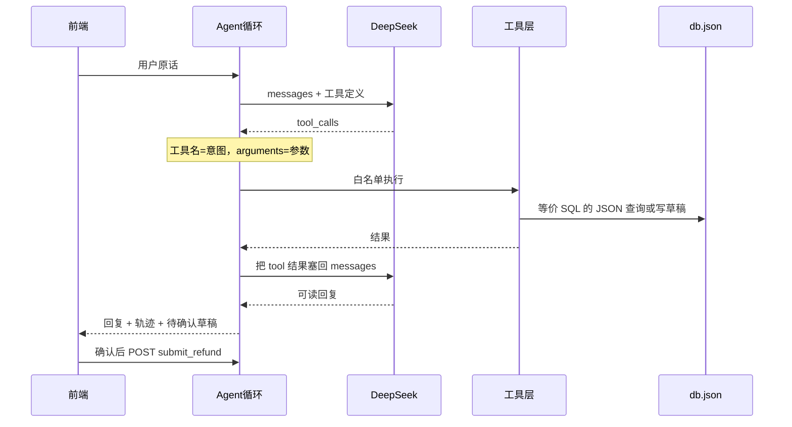

# 双场景 Agent 工具调用 Demo

密钥只写入本地 `.env`（并加入 `.gitignore`），不进源码、不进 git。你刚把 key 贴在对话里，如果这段聊天会被转发或存档，建议在 DeepSeek 控制台轮换一次。Tracking ID `208ebd5c-ab4e-4915-86bb-bd003a5d372f` 不对应 DeepSeek 的接口字段，会作为每次请求的实验编号写进执行轨迹，方便你对照学习。

## 你要看到的链路

模型只负责两件事：选工具、填参数、把工具结果写成中文。真正查数据和退款都在工具层，模型碰不到 JSON，也碰不到“提交退款”。

场景 2 里，`create_refund_draft` 只生成 `pending_confirm` 草稿。`submit_refund` 不放进模型工具列表，只由确认按钮打到 `POST /api/refunds/:draftId/submit`。这样模型无法跳过“是否确认提交退款”。

## 技术选择

- 后端：Node + Express，OpenAI SDK 指向 `https://api.deepseek.com`，模型默认 `deepseek-chat`（官方 function calling 示例用的就是它），可用环境变量改。关闭 thinking，工具选择更稳、延迟更低。
- 数据：[`server/data/db.json`](server/data/db.json)，启动时若不存在就写入种子数据。
- 前端：Vite + React。左侧对话，右侧逐步轨迹。预置两个场景按钮，点一下就能复现你写的两段对话。
- 根目录一条 `npm run dev` 同时起 API（`5174`）和页面（`5173`）。

种子数据里用户 `U10086` 至少 3 笔已支付订单，其中 `O20261009001` 金额 `99.00`，这样场景 2 的草稿金额和你的例子一致。再放一个别的用户，避免看起来像写死的。

## 后端模块

- [`server/src/store.js`](server/src/store.js)：读写 JSON。查询购买记录时在轨迹里带上等价语句 `SELECT * FROM orders WHERE user_id = ? ORDER BY created_at DESC LIMIT 50`，实现仍是过滤排序后取前 50 条。退款草稿写入 `refunds`，提交时把草稿标成 `submitted`、订单标成 `refunded`。同一订单已有未完成草稿或已退款时拒绝再次起草。
- [`server/src/tools.js`](server/src/tools.js)：两份给模型的工具定义，外加一个不对模型开放的提交函数。
  - `get_user_purchase_records(user_id)`
  - `create_refund_draft(order_id)`，返回 `draft_id`、`order_id`、`refund_amount`、`status: pending_confirm`、`require_approval: true`
  - `submitRefund(draftId)` 仅 HTTP 路由可调用
  - 调度器只允许白名单函数名，参数先 `JSON.parse` 再校验，解析失败就把错误当 tool result 交回模型，不执行任何写操作。
- [`server/src/agent.js`](server/src/agent.js)：最多 4 轮。每轮若返回 `tool_calls`，按“先查询、再草稿”的顺序执行（同一轮里模型若两个都叫了，也按这个顺序）。每一步写入轨迹：意图名、提取到的参数、工具名、等价 SQL、工具返回值。全部工具结果送回模型后，由模型生成最终中文回复。
- [`server/src/index.js`](server/src/index.js)：
  - `POST /api/chat`：`{ message, history }` → `{ reply, trace, pendingApprovals, trackingId }`
  - `POST /api/refunds/:draftId/submit`：人工确认后才改数据，返回提交结果
  - `GET /api/orders?userId=`：给页面一个“当前数据”小窗，确认退款前后订单状态变了

系统提示只说明：你是订单助手；查购买记录用查询工具；用户明确要求退款时先起草、不要声称已经退款成功；缺 `user_id` 或 `order_id` 就追问，不要编造。

## 前端

- 聊天气泡 + 右侧轨迹时间线，步骤文案对齐你的流程图：识别意图、提取参数、调用工具、工具层语句、整理回复。
- 若响应里有 `pendingApprovals`，在对话里渲染确认卡：“是否确认提交退款？”，展示金额和订单号。确认打提交接口，取消只留草稿。
- 预置场景 1、场景 2 两句话，也保留自由输入。

## 安全边界

- `.env` 放 `DEEPSEEK_API_KEY` 和 `DEEPSEEK_MODEL`，仓库只留 `.env.example`（空值）。
- 日志不打印密钥。
- 退款金额一律取订单上的金额，不信模型填的金额。
